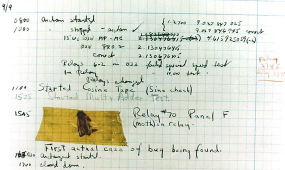

# famous-bugs :bug: :honeybee: :ant: :beetle:

 [](./.github/CODE_OF_CONDUCT.md)

A curated list of bugs, problems and failures that developers may find useful to know.

[Translations](#translations): [🇹🇷](https://github.com/umutphp/famous-bugs/blob/master/README-tr.md)

---

<!-- START doctoc generated TOC please keep comment here to allow auto update -->
<!-- DON'T EDIT THIS SECTION, INSTEAD RE-RUN doctoc TO UPDATE -->
## Table Of Contents

- [Introduction](#introduction)
- [Problems](#problems)
  - [Justin Bieber Problem of Instagram](#justin-bieber-problem-of-instagram)
  - [Gangnam Style Broke YouTube](#gangnam-style-broke-youtube)
  - [Mysterious Traffic Of A Flower Image On Wikimedia](#mysterious-traffic-of-a-flower-image-on-wikimedia)
  - [Year 2000 Problem](#year-2000-problem)
  - [NPM Leftpad Breakage](#npm-leftpad-breakage)
  - [Heathrow Terminal 5 Opening](#heathrow-terminal-5-opening)
  - [Stack Overflow Outage On July 20, 2016](#stack-overflow-outage-on-july-20-2016)
  - [N+1 Query Problem](#n1-query-problem)
  - [Gitlab Database Outage](#gitlab-database-outage)
- [Bugs](#bugs)
  - [The First Bug](#the-first-bug)
  - [The Explosion of the Ariane 5](#the-explosion-of-the-ariane-5)
  - [Metric System Mess Of NASA’s Mars Climate Orbiter](#metric-system-mess-of-nasas-mars-climate-orbiter)
  - [The Morris Worm](#the-morris-worm)
  - [Death by IT](#death-by-it)
  - [The 1990 AT&T Network Collapse](#the-1990-att-network-collapse)
  - [ILOVEYOU Worm](#iloveyou-worm)
  - [The Zune Bug](#the-zune-bug)
  - [The Forgotten Space Character](#the-forgotten-space-character)
  - [Rachel True's Problem On iCloud](#rachel-trues-problem-on-icloud)
- [Translations](#translations)
- [Contributing](#contributing)

<!-- END doctoc generated TOC please keep comment here to allow auto update -->

---

## Introduction

As software developers, we can simply define our work as fixing bugs and developing solutions to problems. This is a curated list of problems and bugs that developers may find useful to know. I hope it will become a community driven list to create a value.

## Problems

### Justin Bieber Problem of Instagram

> Bieber would post a photo, and so many Beliebers would "Like" it that Instagram's computers couldn't keep up.
>
> [Wired.com](https://www.wired.com/2015/11/how-instagram-solved-its-justin-bieber-problem/)

When Justin Bieber posts a photo, so many Beliebers would "Like" it that causes tremendous amount of notifications, queries and processes. This problem faced by the Instagram team is actually a very good example of [the thundering herd problem](https://en.wikipedia.org/wiki/Thundering_herd_problem). They did many improvements to avoid this problem happen again and explained in this [article](https://instagram-engineering.com/instagration-pt-2-scaling-our-infrastructure-to-multiple-data-centers-5745cbad7834).  

Further readings:

- [Thundering herd problem](https://www.wikiwand.com/en/Thundering_herd_problem)
- [How Instagram Solved Its Justin Bieber Problem](https://www.wired.com/2015/11/how-instagram-solved-its-justin-bieber-problem/)

### Gangnam Style Broke YouTube

> We never thought a video would be watched in numbers greater than a 32-bit integer.
>
> YouTube

YouTube's counter was previously using  a 32-bit integer which means the maximum possible views it could count was 2,147,483,647. And "[Gangnam Style](https://www.youtube.com/watch?v=9bZkp7q19f0)" surpassed the 2-billion-view marker. YouTube has upgraded to a 64-bit integer so that the maximum views a video can receive is now 9,223,372,036,854,775,808.

### Mysterious Traffic Of A Flower Image On Wikimedia

> 20% of all requests to one of our data centers for media are for this image of a flower. Nobody knows why.
>
> [Chris Albon](https://twitter.com/chrisalbon/status/1358890731981611009)

On Feb 3, 2021, Wikimedia tech team has noticed that they get about 90M requests per day from various ISPs in India. The requests are all for an image file (see below). They hypothesised that there might be some mobile app that hotlinked the image for e.g. a splash screen. Wikimedia did not reveale the app, but people thought that It may be an alternative app for TikTok. Because, around the time, India took the decision to totally ban TikTok which direct people to use alternative apps. The butterfly effect starting with this decision turned this into a memory to remember for Wikimedia and the mysterious application tech teams.

[](https://en.wikipedia.org/wiki/Symphyotrichum_novi-belgii#/media/File:AsterNovi-belgii-flower-1mb.jpg)

See also:

- [Phabricator Post](https://phabricator.wikimedia.org/T273741)

### Year 2000 Problem

> ... making the year 2000 indistinguishable from 1900.
>

The Year 2000 problem (also known as the Y2K problem, the Millennium bug, Y2K bug, the Y2K glitch, or Y2K) refers to fails occured becuase of the formatting and storage of calendar data for dates beginning in the year 2000. Many failures were already documented all over the world. Here are some examples:

- On 1 January 1999, taxi meters in Singapore stopped working.
- On 1 January 2000, in Onagawa, Japan, an alarm sounded at a nuclear power plant at two minutes after midnight.
- On 1 March 2000, In the United States, the Coast Guard's message processing system was affected.
- Norway and Finland had to change their national identification number, to indicate correctly the century in which a person was born.

Further readings:

- [Year 2000 Problem at Wikipedia](https://en.wikipedia.org/wiki/Year_2000_problem)

### NPM Leftpad Breakage

> An 11 line npm package called left-pad with only 10 stars on github was unpublished...it broke some of the most important packages on all of npm.
>
> [Reddit](https://www.reddit.com/r/programming/comments/4bjss2/an_11_line_npm_package_called_leftpad_with_only/)

[Azer Koçulu](https://kodfabrik.com/) had been publishing a simple code he wrote to npm and It became very popular. Many projects has used his package as a dependency. On March 11, he received an email from a patent and trademark agent who works for Kik which was a messaging app. KiK was also the name of another package of him. They wanted him to rename the Kik package but he did not accept. Then the agency forced NPM to do so. After NPM's decision, Azer Koçulu had taken down all of his packages including left-pad. Then, many JavaScript programmers around the world started getting an error message "npm ERR! 404 'left-pad' is not in the npm registry".

Further readings:

- [I've Just Liberated My Modules
](https://kodfabrik.com/journal/i-ve-just-liberated-my-modules)
- [kik, left-pad, and npm](https://blog.npmjs.org/post/141577284765/kik-left-pad-and-npm)

### Heathrow Terminal 5 Opening

> ... simple real scenarios which for some reason weren’t tested.
>

Heathrow Terminal 5 was officially opened on 14 March 2008. On the day of opening, it did not operate as planned, so It forced British Airways to cancel 34 flights and suspend baggage check-in.

The newest luggage transporting system software couldn’t handle some simple real scenarios which for some reason weren’t tested. For example, a luggage was carried back manually because the owner forgot something in. In this case, the program went off and an item wasn’t recorded. The luggage processing was always disrupted by such kind of little details.

During the following ten days, around 42,000 items weren’t delivered to owners, and over 500 flights were canceled. Check-in to other flights became temporarily unavailable.

Further readings:

- [Technical glitches hit T5 opening](http://news.bbc.co.uk/2/hi/uk_news/7314816.stm)
- [Heathrow Terminal 5](https://en.wikipedia.org/wiki/Heathrow_Terminal_5#Opening) at Wikipedia

### Stack Overflow Outage On July 20, 2016

> The regular expression was: ^[\s\u200c]+|[\s\u200c]+$ ...
>
> [Outage Postmortem - July 20, 2016](https://stackstatus.net/post/147710624694/outage-postmortem-july-20-2016)

On July 20, 2016 StackOverflow experienced a 34 minute outage because of a malformed post that caused one of the regular expressions to consume high CPU on Stack Overlfow web servers. It was a very typical regular expression denial of service (ReDoS) attack but It was occured because the malformed post was displayed on the homepage for a while. So, the regular expression checks (match or mismatch) consumed computational resources. As the homepage is used for healtcheck by the load balancers, the entire site became unavailable.

Further readings:

- [The Regular Expression Denial of Service (ReDoS) cheat-sheet](https://levelup.gitconnected.com/the-regular-expression-denial-of-service-redos-cheat-sheet-a78d0ed7d865)
- [Outage Postmortem - July 20, 2016](https://stackstatus.net/post/147710624694/outage-postmortem-july-20-2016)

### N+1 Query Problem

> ... turns into n+1 requests since the item has n associated items.
>
> [InfoQ](https://www.infoq.com/articles/N-Plus-1/)

The N+1 problem occurs when the code tries to load the children of a parent in a relationship (e.g. one-to-many relations). Nearly all of the ORMs enable lazy-loading by default. Assume that you are willing to create a list of records with the data coming from the relations. One query for fetching the parents and N queries for N parent records (one record per each to fetch the data from relation) are issued. As you can expect, doing N+1 queries instead of a single query will flood your database with queries, which is something we should avoid. Hopefully, ORMs have known the problem for quite long time and they have already build-in solutions. The solution is simple: while developing you should should tell in advance to the ORM that you will need additional data (eager loading).

Further readings:

- [N+1 Queries and How to Avoid Them!](https://medium.com/@bretdoucette/n-1-queries-and-how-to-avoid-them-a12f02345be5)

### Gitlab Database Outage

> ...accidentally deleted the production base. What made things even worse is that the directory holding the copies was empty too — the backups had not been made for a long time due to a configuration error...
>
> [Dzone](https://dzone.com/articles/the-biggest-software-failures-in-recent-years)

On January 31, 2017, Gitlab faced an issue that may be a good incident about the importance of backups. They planned to make a major change their database server setup. During the process, the production database was deleted accidentally. The things got worse when they realized that the backups were not taken for a while becuase of a configuration issue. Most probably, they tried to their best with a big panic but it was resulted in an 18-hour outage with the lost of 300 GB of customer data. Gitlab published an honest and detailed [postmortem](https://about.gitlab.com/blog/2017/02/10/postmortem-of-database-outage-of-january-31/) about the outage.

## Bugs

### The First Bug

> First actual case of bug being found.
>
> [Grace Murray Hopper](https://en.wikipedia.org/wiki/Grace_Hopper)

On September 9, 1947, the [Mark II](https://en.wikipedia.org/wiki/Harvard_Mark_II) (at Harvard University) broke down. Engineers investigated and diagnosed the cause. A moth had entered the machine and had shorted out relay number 70 of Panel F. They attached the bug to the page with with a note "First actual case of bug found.". This is how the term "bug" was born.



The sheet is kept at the [National Museum of American History of the Smithsonian Institution](https://americanhistory.si.edu/collections/search/object/nmah_334663) in Washington.

Further readings:

- [Harvard Mark II](https://en.wikipedia.org/wiki/Harvard_Mark_II)
- [Grace Hopper](https://en.wikipedia.org/wiki/Grace_Hopper)

### The Explosion of the Ariane 5

> ... a 64 bit floating point number ... was converted to a 16 bit signed integer.
>

On June 4, 1996 the Ariane 5 rocket launched by the European Space Agency exploded just forty seconds after its lift-off. The rocket was on its first voyage, after a decade of development costing $7 billion. The destroyed rocket and its cargo were valued at $500 million. The accident was a significant setback for Europe’s space program.

The horizontal velocity of the rocket with respect to the platform was larger than 32,767, the largest integer storeable in a 16 bit signed integer, and thus the conversion failed.

Further readings:

- [Report: Software Design Errors Caused Ariane 5 Explosion](https://apnews.com/article/1d85f290e31cad8532636fcb576f4788)

### Metric System Mess Of NASA’s Mars Climate Orbiter

The Mars Climate Orbiter was a robotic space probe launched by NASA on December 11, 1998 to study the Martian climate. The navigation team used the metric system in its calculations, while the team designing and building the spacecraft, provided crucial acceleration data in the English metric system. The acceleration readings measured in units of pound-seconds^2 for a force called newton-seconds^2. In a sense, the spacecraft was lost in translation.

Further readings:

- [Mars_Climate_Orbiter#Cause_of_failure](https://en.wikipedia.org/wiki/Mars_Climate_Orbiter#Cause_of_failure)

### The Morris Worm

> This was a design flaw ...
>

According to its creator, [Robert Tappan Morris](https://en.wikipedia.org/wiki/Robert_Tappan_Morris), It was not written to cause damage, but to highlight security flaws. It was programmed to exploit the known vulnerabilities in [sendmail](https://en.wikipedia.org/wiki/Sendmail), [finger](https://en.wikipedia.org/wiki/Finger_protocol), [rsh/rexec](https://en.wikipedia.org/wiki/Berkeley_r-commands) and weak passwords. While creating the worm, Robert programmed the worm to copy itself 14% of the time to avoid system administrators trying to defeat the worm by instructing the computer to report a false positive. This was a design flaw and created fork bombs and crashes in the affected computer.

The Morris Worm is accepted as one of the first computer worms distributed via the Internet and It was the first to gain significant mainstream media attention. A floppy disk containing the source code for the Morris Worm is held at the [Computer History Museum](https://computerhistory.org/).

Further readings:

- [Morris Worm](https://en.wikipedia.org/wiki/Morris_worm)
- [Robert Tappan Morris](https://en.wikipedia.org/wiki/Robert_Tappan_Morris)

### Death by IT

> One digit was dropped from a computer code to indicate the patients were "deceased" rather than "discharged to home".
>
> [Apnews](https://apnews.com/article/6870c9bd785360007b5981f0d5443b19#:~:text=A%20computer%20error%20at%20Saint,of%20other%20patients%20as%20deceased.&text=The%20glitch%20happened%20during%20a,told%20The%20Grand%20Rapids%20Press.)

In 2002, St. Mary's Mercy Medical Center in Grand Rapids erroneously reported that 8500 patients dead because of a glitch in their patient management software. False death reports weren't only sent to patients but also to the insurance companies and social security offices. There is a clear announcement about how the problem was fixed but the management software was changed.

Further readings:

- [Hospital Revives Its "Dead" Patients](https://www.baselinemag.com/c/a/Projects-Networks-and-Storage/Hospital-Revives-Its-QTEDeadQTE-Patients)

### The 1990 AT&T Network Collapse

> An error in just one line of code brought down AT&T's network for several hours.
>
> [MakeUseOf](https://www.makeuseof.com/tag/worst-programming-mistakes-in-history/)

Before this collapse, AT&T's long-distance network was accepted as reliable and strong. It was carrying over 70% of the nation's long-distance traffic and routing over 115 million telephone calls. This collapse resulted in a $60 million lost as of 75 million missed phone by AT&T customers calls and 200 000 airline and hotel reservations and other businesses that relied on the telephone network.

The bug occured because of a break statement in an if clause nested in a switch clause in the upgraded recovery software of all switches. All the switches became unreliable at the same time while each switch tries to determine if the neighbor switches were reliable or not.

```bash
1  while (ring receive buffer not empty  and side buffer not empty) DO
2    Initialize pointer to first message in side buffer or ring receive buffer
3    get copy of buffer
4    switch (message)
5       case (incoming_message):
6             if (sending switch is out of service) DO
7                 if (ring write buffer is empty) DO
8                     send "in service" to status map
9                 else
10                    break
11            END IF
12            process incoming message, set up pointers to optional parameters
13            break
14      END SWITCH
15   do optional parameter work
```

Further readings:

- [The 1990 AT&T Long Distance Network Collapse](https://jonhtaylor.com/the-1990-att-long-distance-network-collapse/)
- [All Circuits are Busy Now: The 1990 AT&T Long Distance Network Collapse](https://users.csc.calpoly.edu/~jdalbey/SWE/Papers/att_collapse.html)

### ILOVEYOU Worm

> The events inspired the song "E-mail" on the Pet Shop Boys' UK top-ten album of 2002, Release, the lyrics of which play thematically on the human desires which enabled the mass destruction of this computer infection.
>
> [Wikipedia](https://en.wikipedia.org/wiki/ILOVEYOU#Impact)

ILOVEYOU worm was created by Onel de Guzman (a college student in Manila Philippines) and infected over ten million Windows personal computers after 4 May 2000. His purpose was to steal passwords that he could use other users' internet accounts without paying for the service. He stated that the worm was very easy to create, because there was a bug in Windows 95 that would run code in email attachments.

Originally, he designed the worm to only work in Manila. Out of curiosity, he removed this geographic restriction and allowed the worm to spread worldwide. Of course, he did not expect this worldwide spread. The worm moved first to Hong Kong, then to Europe, and finally the United States. Within ten days, over fifty million infections (10% of internet-connected computers in the world) had been reported. To protect themselves, The Pentagon, CIA, the British Parliament and most large corporations decided to completely shut down their mail systems.

The worm provided users a way to modify it and this allowed more than twenty five variations of ILOVEYOU to spread across the internet, each one doing different kinds of damage.

This worm created a public awareness of the real threat of malwares and antivirus software providers entered a golden era of distribution. Aditionally, It helped many people to be more skeptical of emails which were the classic virus delivery systems.

Further readings:

- [ILOVEYOU at Wikipedia](https://en.wikipedia.org/wiki/ILOVEYOU)
- [A decade on from the ILOVEYOU bug](https://www.bbc.com/news/10095957)

### The Zune Bug

> Judgment day has arrived for owners of 30GB Zunes...
>
> [ArsTechnica](https://arstechnica.com/information-technology/2008/12/30gb-zunes-prepare-for-new-year-by-locking-up/)

On December 31, 2008 many owners of Zune Player started reporting the player started freezing. The response from Microsoft was to wait until the next day and the freeze will be solved by itself. The reason was a simple loop causing infinite execution on leap years. A simple loop control statement which was coded without considiring the leap years caused this mess.

Here is the problematic loop;

```bash
year = ORIGINYEAR;
while (days > 365)
{
    if (IsLeapYear(year))
    {
        if (days > 366)
        {
            days -= 366;
            year += 1;
        }
    }
    else
    {
        days -= 365;
        year += 1;
    }
}
```

Further readings;

- [The Zune Bug](http://bit-player.org/2009/the-zune-bug) At Bit-Player

### The Forgotten Space Character

> GIANT BUG... causing /usr to be deleted... so sorry....
>
> [MrMEEE](https://github.com/MrMEEE/bumblebee-Old-and-abbandoned/issues/123#issuecomment-1226289)

[Bumblebee](https://github.com/Bumblebee-Project/Bumblebee) is a project to make Nvidia Optimus enabled laptops work in GNU/Linux systems. On May 24, 2011 an [issue](https://github.com/MrMEEE/bumblebee-Old-and-abbandoned/issues/123) was created because the installation script deletes the */usr/* folder. The reason was a forgotten mistyped space in the script. The effect of the bug is so hursh becuase the victim should reinstall the OS after. The [issue](https://github.com/MrMEEE/bumblebee-Old-and-abbandoned/issues/123) still attracts attention and you can see the recent comments (On Mar 7, 2021).

```bash
....
rm -rf /usr /lib/nvidia-current/xorg/xorg
....
```

### Rachel True's Problem On iCloud

> Anyone else getting this error from Apple iCloud ? In past or now? ...
>
> [Rachel True](https://twitter.com/RachelTrue/status/1365461618977476610)

Rachel True shared on Twitter thats she’s getting a error when attempting to log into iCloud. It may be appearing because the iCloud is interpreting her last name "True" as a boolean value. In her tweet, she noted that she’d been locked out for over 6 months and the problem is still valid at 27 February, 2021. As this tweet is very popular now, most probably the iCloud team will notice it and come up with a solution soon.

It is a very common and simple bug because developers tends to forget the importance of the types values. Here are some other similar cases;

- [Jesse Self](https://twitter.com/JesseSelf720/status/1368247643827281926)
- [Hello, I'm Mr. Null. My Name Makes Me Invisible to Computers](https://www.wired.com/2015/11/null/)

## Translations

This is available in a number of languages.

| Language | Maintainer |
|----------|-----------|
| [🇹🇷 Türkçe / Turkish](https://github.com/umutphp/famous-bugs/blob/master/README-tr.md) | [Umut Işık](https://github.com/umutphp) |

If you would like to update a translation or add a new language, just [open a pull request](https://github.com/umutphp/famous-bugs/pulls).

## Contributing

Please do contribute! :pray:

[Raise an issue](https://github.com/umutphp/famous-bugs/issues/new) if you'd like to suggest an addition or change, or [Open a pull request](https://github.com/umutphp/famous-bugs/pulls) to add your own.

Please read the [Contributing Guidelines](./.github/contributing.md) and the [Code of Conduct](./.github/CODE_OF_CONDUCT.md) documents.
